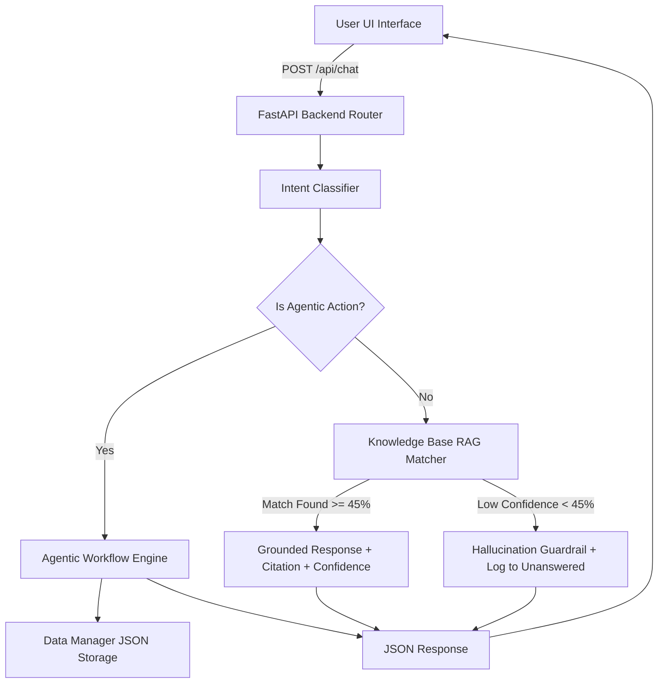

# Product Requirements Document (PRD)

## Project Name: Club FAQ Assistant (GDG On Campus)
**Version:** 1.0.0  
**Target Delivery:** Step-by-step Implementation  
**Status:** Draft for Review  

---

## 1. Executive Summary
The **Club FAQ Assistant** is an AI-powered conversational platform built for GDG On Campus. It provides grounded answers to student queries, retains multi-turn context, classifies intents, provides confidence scores, cites sources, executes agentic workflows (like Event Registration and Feedback Submission), and provides real-time analytics for club leadership via an Admin Dashboard.

---

## 2. Problem Statement & Key Objectives
- **Problem**: Club members and prospective applicants frequently ask repetitive questions about teams, events, recruitment schedules, and club rules across multiple channels.
- **Objectives**:
  1. Build a grounded FAQ chatbot that strictly uses club knowledge and prevents hallucinations.
  2. Implement multi-turn conversational memory (contextual follow-ups).
  3. Provide source citations and confidence metrics for every answer.
  4. Implement intent classification to categorize queries automatically.
  5. Enable agentic action execution (gathering information conversationally and confirming completed tasks).
  6. Provide an Admin Dashboard displaying chat statistics, intent breakdown, actions log, and unanswered queries.

---

## 3. Knowledge Base Scope (Grounded Knowledge)
The system is grounded strictly in the following dataset:
- **Club Intro**: Founded in 2022, 150+ tech enthusiasts, organizes workshops, hackathons, and speaker sessions.
- **Teams**: AIML (Rahul Sharma), Web Dev (Priya Patel), App Dev (Arjun Mehta), Cloud (Sneha Gupta), Cybersecurity (Vikram Singh), Design (Ananya Reddy).
- **Events**:
  - *Upcoming*: Intro to GenAI Workshop (Sept 15), HackFest 2025 (Oct 10), Cloud Study Jam (Sept 20), Design Thinking Bootcamp (Sept 25), CyberCTF Challenge (Nov 5).
  - *Completed*: Flutter Forward (Aug 30).
- **Recruitment**: Application Form → Tech Assessment (1 wk) → Interview (15 min) → Results (1 wk) → Onboarding (2 wks). Window: Sept 1–15, 2025. Eligibility: 1st–3rd year.
- **Rules**: Min 2 events/month to stay active. 2 months inactive = alumni status. Team switch once/semester. Min 1 project contribution/semester.
- **Contacts**: President (Aditya Kumar, president@gdgoncampus.com), VP (Meera Joshi), Tech Head (Rohan Desai), General (info@gdgoncampus.com).
- **Achievements**: Best Community Award at DevFest 2024, 12 open-source projects (500+ GitHub stars), 25+ workshops in 2024–25, partnerships with 3 college clubs.

---

## 4. Feature Requirements & User Stories

### 4.1 Core Chatbot & Smart Features
| Feature | Description | Acceptance Criteria |
|---|---|---|
| **Grounded Q&A** | Answers questions based *only* on knowledge base. | Returns accurate answers; explicitly rejects out-of-scope questions without fabricating data. |
| **Multi-turn Memory** | Remembers session context across messages. | "Who leads it?" correctly resolves based on previous subject. |
| **Source Citation** | Mentions exact source path in response. | Displays tag like `Source: Teams > AIML`. |
| **Confidence Scoring** | Computes confidence score (0-100%). | Visual indicator (e.g. `95% High Confidence`). |
| **Intent Classification** | Categorizes intent. | Tags response with `FAQ`, `Event Inquiry`, `Action Request`, `Greeting`, or `Out of Scope`. |

### 4.2 Agentic Actions
1. **Action 1: Event Registration**
   - User expresses intent to register (e.g., *"Register me for the GenAI workshop"*).
   - Bot conversationally collects: `Full Name`, `Email`, `Academic Year` (1st-3rd year), and `Target Event`.
   - Bot validates details, saves registration to database, and issues a Confirmation Ticket ID.
2. **Action 2: Feedback & Query Submission**
   - User wants to leave feedback or ask a custom question for leads.
   - Bot collects: `Feedback Category`, `User Email`, and `Message`.
   - Bot logs entry and confirms submission.
3. **Action 3: Recruitment Status Check**
   - User inquires about application status.
   - Bot collects `Email` or `Application ID` and returns current stage.

### 4.3 Admin Analytics Dashboard
- **Chat Stats KPI**: Total Conversations, Solved Rate, Agentic Actions Count, Unanswered Queries Count.
- **Intent Breakdown**: Interactive Donut/Bar Chart showing distribution of user intents.
- **Actions Log Table**: Live filterable table showing registrations and feedback entries.
- **Unanswered Queries Queue**: Logged list of low-confidence (<45%) user queries with option to review.

---

## 5. Technical Architecture & Data Flow

---

## 6. Step-by-Step Implementation Roadmap

- **Step 1**: PRD & User Confirmation (Current Step)
- **Step 2**: Data Architecture & Knowledge Base (`data/club_knowledge.json`)
- **Step 3**: Core AI Engine & Hallucination Guardrail (`kb_engine.py`, `intent_classifier.py`)
- **Step 4**: Agentic Workflow Engine (`agent_engine.py`)
- **Step 5**: FastAPI REST API Endpoints (`main.py`)
- **Step 6**: Web Frontend (Chat UI + Admin Dashboard) (`index.html`, `style.css`, `app.js`)
- **Step 7**: Testing & End-to-End Verification
